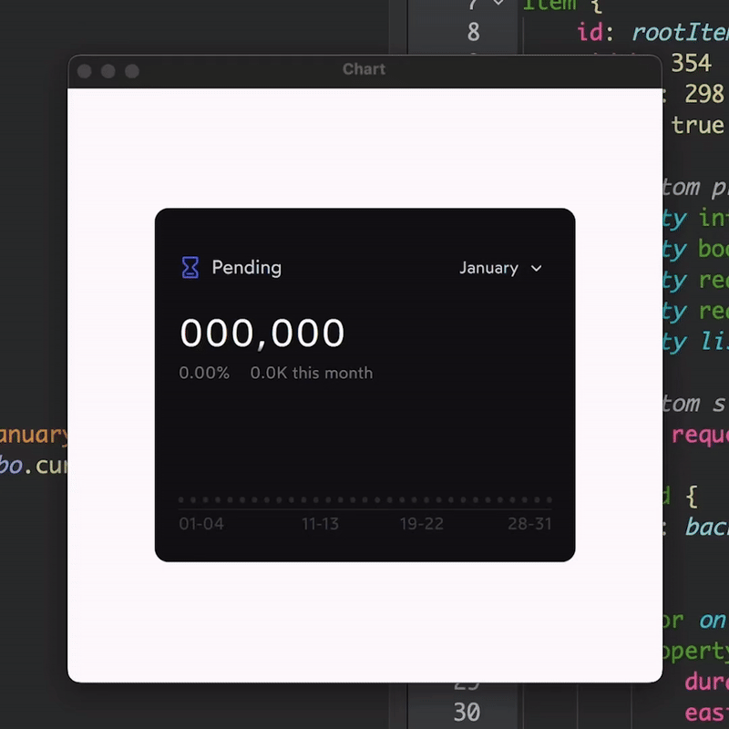

# QuteChart: A Collaborative UI Design and Implementation Project

Welcome to QuteChart, a collaborative endeavor between Parham Oyan and [Sina Nouri](https://dribbble.com/SinaNouri) to develop an intuitive and visually appealing chart interface.

  

## Overview

QuteChart is the culmination of our joint efforts to create a user-friendly and aesthetically pleasing charting solution.

## Features

- **Simplified Visuals**: Our aim is to provide users with a clear and straightforward visual representation of their data.
- **Subtle Animations**: We've integrated subtle animations to enhance the user experience without detracting from usability.
- **User-Centric Design**: Every aspect of the interface is designed with the user's needs and preferences in mind.
- **Efficient Performance**: Despite its visual richness, QuteChart is optimized for performance, ensuring smooth operation.

## Technologies Used

- **QML**: Utilized for creating the user interface components.
- **JavaScript**: Implemented for logic and interactivity.
- **C++**: Employed for backend operations.

## Contact
For inquiries or feedback, don't hesitate to contact parhamoyan@yahoo.com.
